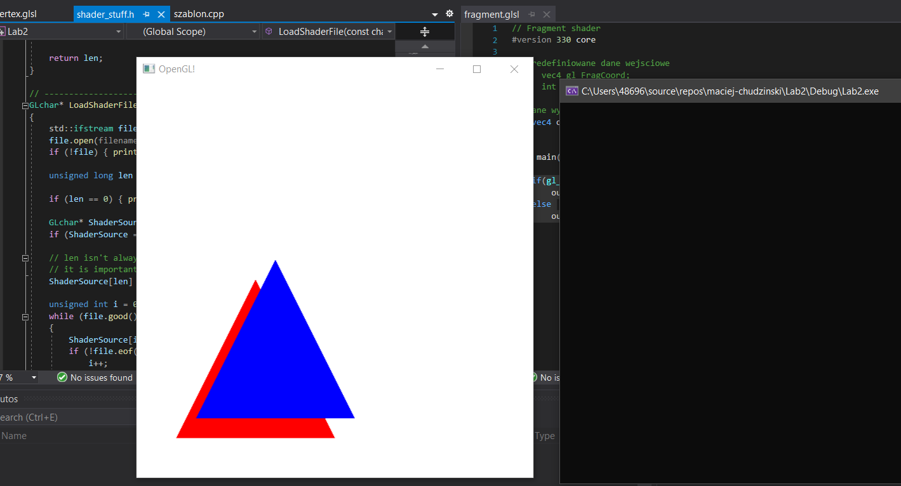

Zadanie:
Napisz program, który wyświetla na ekranie dwa trójkąty o różnych kolorach, które nachodzą na siebie.
Czy będzie widać wtedy tylko jeden, a jeśli tak to który? Czy może będą się przenikały, a jeśli to w jaki sposób? Zrób oczywiście zrzut ekranu i dołącz do swojego kodu programu.

Odpowiedz
Obiekty sa wczytywane pokolei, wedlug danych w liscie. Z tego wzgledu obiekt, ktory wczytany jest ostatni nadpisuje wartosc wektora rgb piksela na ekranie. W moim przykladzie trojkaty tylko czesciowo sie nachodza, zeby to uwidocznic.
Czerwony jest z id = 0, niebieski z id = 1.

