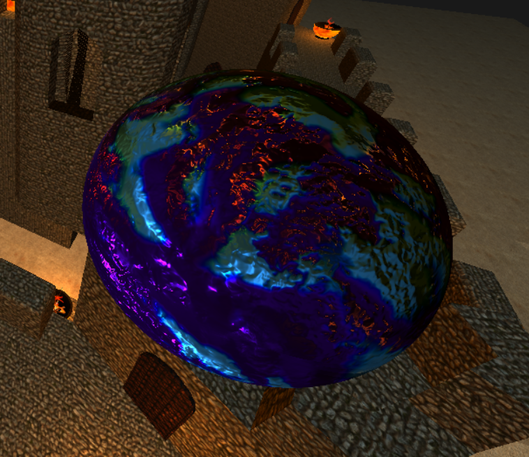
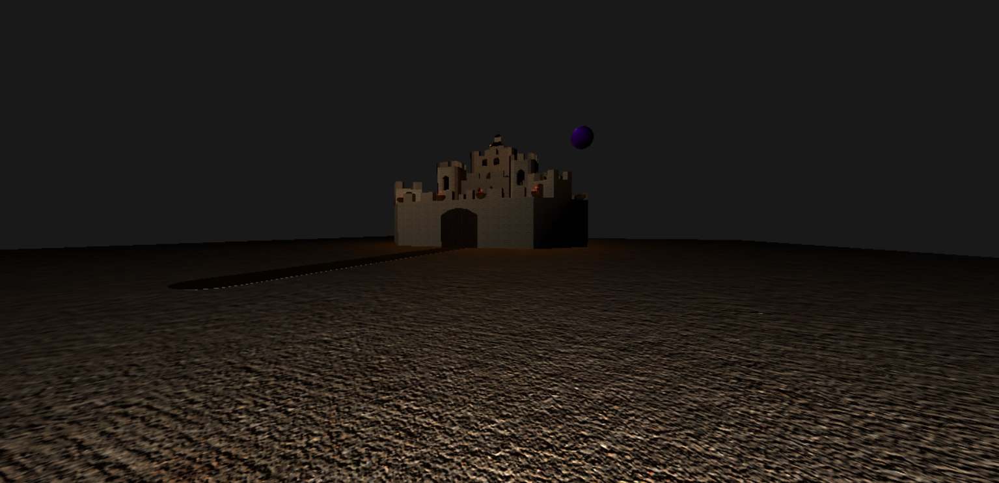
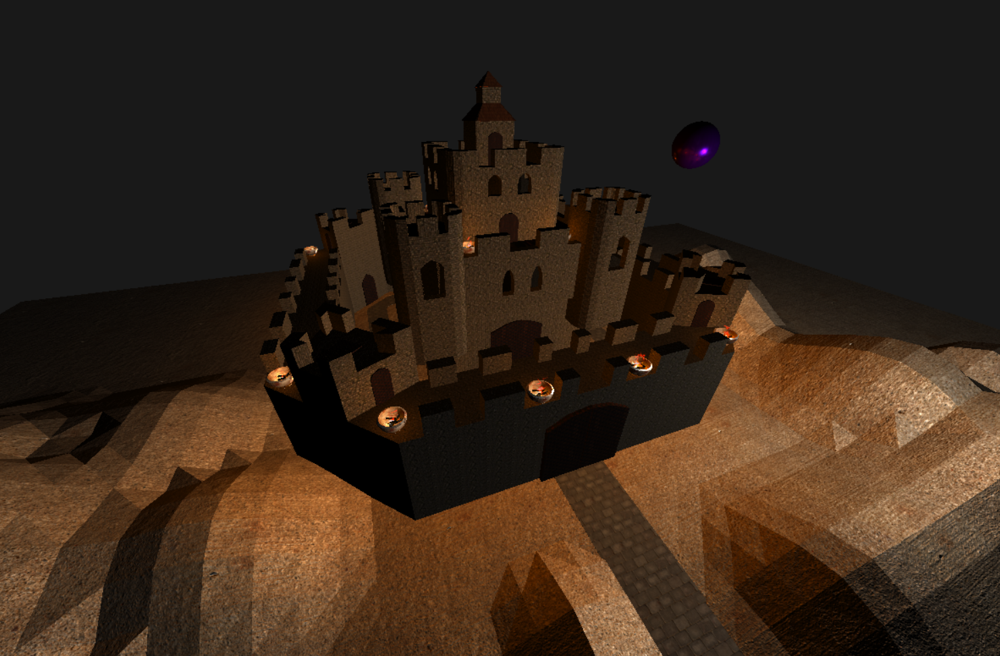
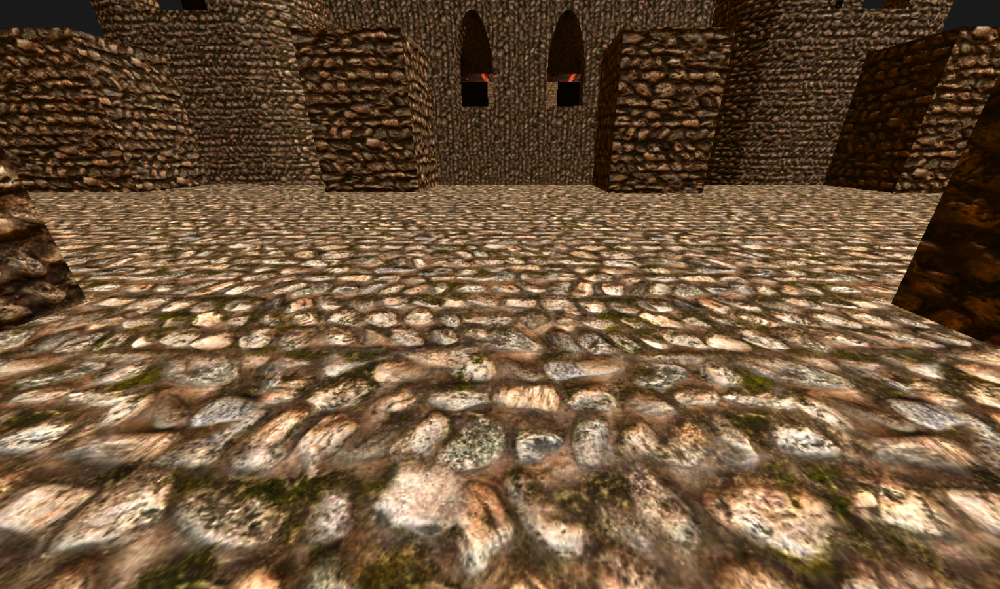
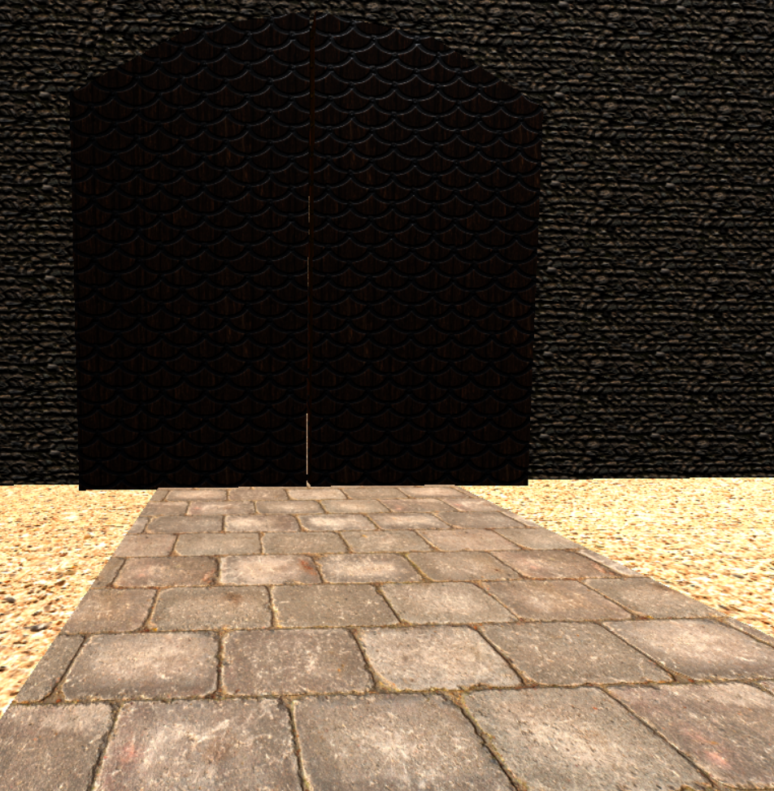
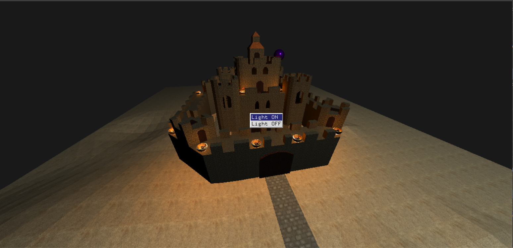
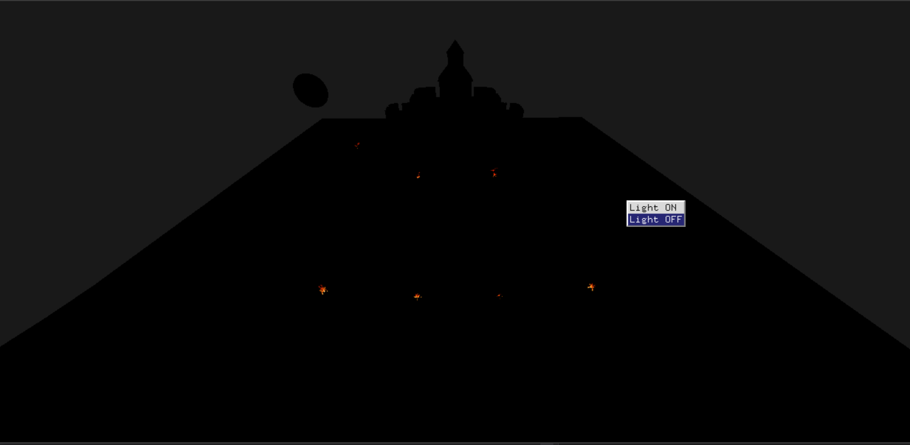

Roznice miedzy poprzednimi labolatoriami:
1. Tekstury:
 - porzucenie modelu ambient-diffuse-specular
 - obiekty sa obecnie wyswietlane z uzyciem tekstur albedo, roughness, ambient-occlusion oraz normal
2. Oswietlenie:
 - zaprzestanie korzystania z swiatla kierunkowego (wymuszenie na pbr)
 - swiatlo nie posiada juz wartosci ambient-diffuse-specular
3. Renderowanie:
 - wykorzystanie metod do wyliczania pbr przy uzyciu nowych tekstur
4. Struktura klas:
 - redukcja zuzycia pamieci przez refaktoryzacje kodu, zastosowania unikatowych tekstur
5. Obsluga wejsc:
 - obracanie mysza
 - menu kontekstowe

 

